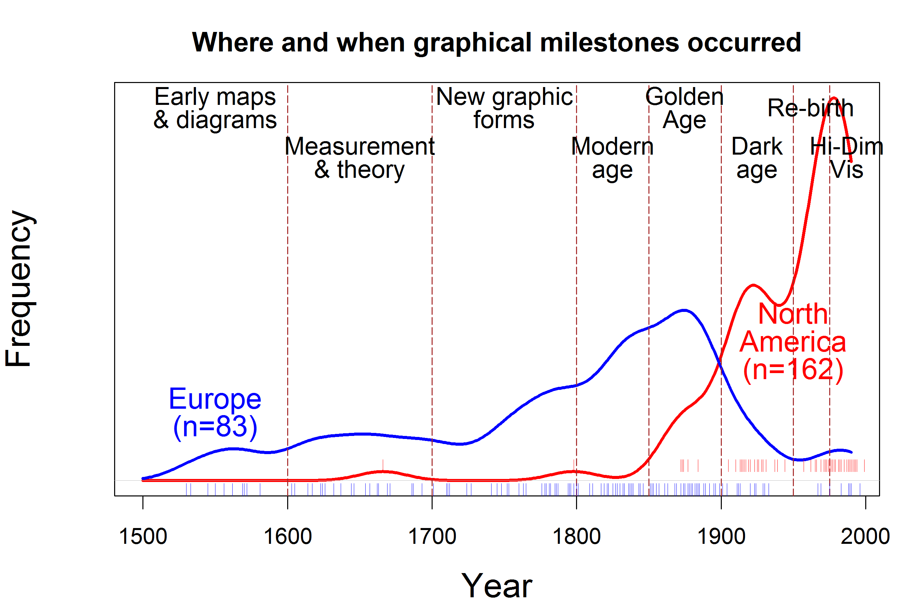

--- 
title: "Data Visualization History"
author: "Michael Friendly and Howard Wainer"
date: "`r Sys.Date()`"
site: bookdown::bookdown_site
documentclass: book
bibliography: [book.bib, packages.bib]
biblio-style: apalike
link-citations: yes
cover-image: "fig/playfair-cover-title-70.png"
description: "This is a sketch of a web site to accompany our forthcoming book to be published by Harvard University Press."
---

## Cover image {-}
The front cover shows the main image from William Playfair's (1805)
*Chart of Universal Commercial History*. In it, he asks: 
How and when did civilizations rise and fall from 1500 BCE to 1800 AD?
He shows ancient and modern civilizations in the form of small graphs
over time, representing some indication of strength of an empire
or civilization, in a way that then can be visually compared to
ask further questions: Why were some so long-lived? When and
why did some of them fail?
Another implicit question is how to visualize a history
and tell its story.

This graph uses what at the time was a novel graphic form
of small little distributions showing the relative strength
of each civilization over time. It was recently re-invented
and called a ``ridgeline'' plot because it resembles a set of
mountain ridges. See further discussion of this graph shown
as Figure~\ref{fig:playfair1805-inquiry}.  

```{r out.width="100%", echo=FALSE, eval=TRUE}

```

# Aims {-}

These pages are an initial sketch of a web site to accompany our forthcoming book to be published by Harvard University Press.
We try to provide an overview of the book, and include some images and text that does not appear in the printed edition.

This book aims to give a comprehensive history of data visualization with an emphasis on these questions:

* How did the graphic depictions of numbers arise? 
* More importantly, **why**?
    - What factors led to the key innovations in graphs and diagrams that are commonplace today? 
    - How did graphic inventions make a difference in understanding natural and social phenomena and communicating results?


<!--chapter:end:index.Rmd-->

# Introduction {-}

> *The only new thing in the world is the history you don't know.*
> Harry S. Truman, quoted by David McCulloch

## A long history {-}

- The Graphics Social Reporting Project

- The Milestones Project

- Statistical historiography: Visualizing time and history

<!-- ```{r out.width="100%", echo=FALSE, eval=TRUE} -->
<!--  -->
<!-- ``` -->

## Overview {-}

- Re-vsions

- Chronology vs. Theme

## Synopsis of book {-}

**Chapter 1**: *In the Beginning ...* is an overview of the larger questions
and themes that provide a context for the book. We consider the
relations among numerical data, evidence for an argument and graphs, and
then describe some of the pre-history of the visual representation of
numbers and the early rise of visualization itself. The story continues
to the rise of empirical thinking in philosophy and science around the
16th century and the concomitant remarkable development of the visual
representation of numbers to communicate quantitative phenomena.

From there we explore a fundamental and difficult problem in the
17th century: the determination of longitude at sea.
In **Chapter 2**: *The First Graph Got it Right* we show how Michael
Florent van Langren had the idea to make a graph of historical
determinations of the longitude distance from Toledo to Rome, in what is
arguably the first graph of statistical data.

In **Chapter 3**: *The Birth of Data* we trace the role of data in the initial
rise of graphical methods around the early 1800s. We focus attention on
one important participant in this story: Andre-Michel Guerry
[1802--1866], who used an ``avalanche of data'' and graphical
methods to help invent modern social science.


<!--chapter:end:ch00-preface.Rmd-->

# In the Beginning... {#ch01-intro}

> *If you would understand anything, observe its beginning and its development.*
>
> Aristotle

```{block, type="chapterprelude"}
#### Synopsis {-}
This chapter is an overview of the larger questions and themes that
provide a context for the book. We consider the relations among numerical data, evidence for an argument and graphs,
and then describe some of the pre-history of the visual representation of numbers and the early rise of 
visualization itself. The story continues to the rise of empirical thinking in philosophy and
science around the 16th Century and the concomitant
remarkable development of the visual representation of numbers to communicate quantitative phenomena.
```


## Data, evidence and graphs {#sec:data-evidence-and-graphs}

### Graphs: Communication and persuasion {-}

## Words, numbers and pictures {#sec:words-numbers-and-pictures}

### Recording numbers {-}

### The evolution of pictures {-}

### Connecting data with pictures {-}

## Seeing the unexpected {#sec:seeing-the-unexpected}

## The Rise of the Graphic Method and Visual Thinking {#sec:the-rise-of-the-graphic-method}

## A Golden Age {#sec:a-golden-age}

## Learning more {#sec:learning-more}


<!--chapter:end:ch01-intro.Rmd-->

# Why the First Graph Got It Right {#ch02-langren}

```{block, type="chapterprelude"}
#### Synopsis {-}
A fundamental and difficult problem in the 17th century was determination of longitude at sea. A variety of methods were tried, but none were very accurate. To demonstrate the problem (and seek patronage from King Philip of Spain), Michael Florent van Langren had the idea to make a graph of historical determinations of the longitude distance from Toledo to Rome, in what is arguably the first graph of statistical data. This chapter shows why this was exactly the right thing to do.
```

## Early things called "graphs" 

### Later things called "graphs" {-}

## The problem of longitude 

### Show me the money {-}

### Who was van Langren? {-}

## Van Langren's graph 

### Patronage and grantsmanship {-}

### Eyes on the prize {-}

### Claiming priority {-}

### The "secret" of longitude {-}

### Van Langren's legacy {-}

## Learning more 


<!--chapter:end:ch02-langren.Rmd-->

# The Birth of Data {#ch03-data}

```{block, type="chapterprelude"}
#### Synopsis {-}
This chapter traces the role of data in the initial rise of graphical methods around the early 1800s.
We start with the very idea of numbers used for some wider purpose, and considered what what we now
call "data".
We focus attention on one important participant in this story: Andr\'e-Michel Guerry [1802--1866], who used an "avalanche of data" and graphical methods to help invent modern social science.
```

## When was the idea of "data" invented? 

### Flooding of the Nile {-}

### Ephemeris tables {-}

### Political arithmetic {-}

### The human sex ratio {-}

## The rise of "Moral Statistics": An avalanche of numbers 

### Mapping social data {-}

### Graphic details matter {-}

## Social laws: Stability and variation 

### Seeking explanations, causes and relationships {-}

### Guerry (1864): Analytical statistics {-}

## Re-visions: Consulting for Guerry 

## Learning more 


<!--chapter:end:ch03-data.Rmd-->

# Vital Statistics: William Farr, John Snow and Cholera {#ch04-vital}

```{block, type="chapterprelude"}
#### Synopsis {-}

A short time later, analogous widespread data collection was begun in the United Kingdom, but this
was in the context of social welfare, poverty, public health and sanitation.
From these efforts emerged two new heroes of
data visualization, William Farr and John Snow, who worked independently trying to
understand the causes of several epidemics of cholera and how the disease could
be mitigated.
```

## The General Registrar Office {#sec:general-registrar-office}

## Cholera {#sec:cholera}

## Farr and the miasmatic theory of disease {#sec:farr}

### Farr's diagrams {-}

### Farr's Natural Law of Cholera {-}

### The transcendent effect of water {-}

## John Snow on cholera {#sec:john-snow-on-cholera}

### The Broad Street pump {-}

### The neighborhoods map {-}

## Re-visioning the Broad Street pump {#sec:re-visioning}

## Conclusion: Graphical successes and failures {#sec:conclusions}

### The answer: A bug {-}

### Florence Nightingale's graphical success {-}

### Cholera today {-}

## Learning more 


<!--chapter:end:ch04-vital.Rmd-->

# The Big Bang: William Playfair, the Father of Modern Graphics {#ch05-playfair}

```{block, type="chapterprelude"}
#### Synopsis {-}

At the beginning of the 19th Century, nearly all of the modern forms of data graphics--- the pie chart, the line graph of a time series, and the bar chart--- were invented. These key developments were all due to a wily Scot named William Playfair. He can rightly be called the father of modern graphical methods, and it is only a slight stretch to consider his contributions to be the Big Bang of data graphics. 
```

## An Introduction to William Playfair {#sec:playfair-intro}

## Playfair's graphic contributions {#sec:playfair-contributions}

## The First Pie {#sec:playfair-pie}

### Humble pie {-}

### So, what are pies good for? {-}

## Time-series line graphs {#sec:playfair-time-series}

### Trade between England and Germany: 1700--1800 {-}

### Trade between England and France: 1700--1800 {-}

### Playfair's failure: Problems with curve-difference charts {-}

### England's National Debt: 1688--1800 {-}

## Bar charts {#sec:playfair-bar-charts}

### Earlier bar charts {-}

## Charts of history {#sec:playfair-history}

### Sparklines {-}

### Joyplots, a.k.a. ridgeline plots {-}

## Why Playfair? {#sec:playfair-why}

### Playfair's legacy {-}

## Learning more 


<!--chapter:end:ch05-playfair.Rmd-->

# The Origin and Development of the Scatterplot {#ch06-scat}

```{block, type="chapterprelude"}
#### Synopsis {-}
Among all the moderns forms of statistical graphics,
the scatterplot may be considered the most versatile,
and generally useful invention in the entire history of statistical
graphics. It is also notable because William Playfair didn't invent it.
This chapter considers why Playfair was unable to think about such things,
and it traces the invention of the scatterplot to the eminent astronomer John F. W. Herschel.
Scatterplots achieved great importance in the work
of Francis Galton [1822--1911] on the heritability of traits.
Galton's work, visualized through statistical diagrams,
became the source of the statistical ideas of correlation and regression and thus most of
modern statistical methods.

```
## Early displays that were not scatterplots {#sec:scat-early}

### Johann Lambert {-}

## Why not Playfair? {#sec:why-not-playfair}

## John F. W. Herschel and the orbits of twin stars {#sec:scat-herschel}

### Herschel's graphical impact factor {-}

## Francis Galton and the idea of correlation {#sec:scat-galton}

### Sweet peas and regression toward the mean {-}

### Galton's elliptical insight {-}

### Another asymmetry {-}

## Some remarkable scatterplots {#sec:scat-remarkable}

### The Hertzsprung-Russell diagram {-}

### Inflation and unemployment: The Phillips curve {-}

## Spurious correlations and causation {#sec:scat-spurious}

## Summary and conclusion 

## Learning more 


<!--chapter:end:ch06-scat.Rmd-->

# The Golden Age of Statistical Graphics {#ch07-golden}


```{block, type="chapterprelude"}
#### Synopsis {-}
In the latter half of the 19th Century, enthusiasm for graphical methods matured, and a variety of developments in statistics, data collection and technology combined to produce a "perfect storm" for data graphics. The result was a qualitatively distinct period that produced works of unparalleled beauty and scope, the likes of which would be hard to duplicate today. We argue that this period deserves to be recognized as the "Golden Age of Statistical Graphics." 
```

## Quaint and curious volumes of forgotten lore 

## Ages in the history of graphics {#golden-ages}

## Some Golden Ages 

## Prerequisites for the Golden Age 

### Lithography and color printing {-}

### Automatic recording {-}

### Calculation {-}

## Contributions of the Golden Age {#sec:golden-contrib}

### The Graphic vision of Charles Joseph Minard {-}

### Francis Galton's greatest graphical discovery {-}

### Statistical albums {-}

## The Modern Dark Ages 

## Learning more 


<!--chapter:end:ch07-golden.Rmd-->

# Escaping Flatland {#ch08-flatland}

```{block, type="chapterprelude"}
#### Synopsis {-}
Displays of data are necessarily produced on a two-dimensional surface-- paper or screen. Yet 
these are often at worst, misleading, or at best, incomplete. The representation of multidimensional phenomena on a two-dimensional surface was, and remains, graphics greatest challenge. In this chapter we discuss and illustrate some of the approaches that were used to communicate multidimensional phenomena within the practical limitations that we are always faced with.
```

## The Blessings of Dimensionality 

## Contour maps 

## Three-dimensional plots {#sec:3dplots}

## Going forward 

## Learning more 


<!--chapter:end:ch08-flatland.Rmd-->

# Visualizing Time and Space {#ch09-motion}

```{block, type="chapterprelude"}
#### Synopsis {-}
The recent history of data visualization is much harder to characterize because
innovations have been so varied, and have occurred at an accelerated pace and
have appeared across a wider range of disciplines.
Among the many threads that could be traced, two general categories stand out; these have made
data graphics far more powerful and accessible than ever before.
First, graphical methods have become increasingly dynamic and interactive,
capable of showing changes over time by animation and changing the nature of a graph
from a static image to one that a viewer can directly manipulate, zoom or query.
Second, the escape from flatland has been continued, with a variety of new approaches to 
understanding data in ever higher dimensions.

```

## The Laws of Motion 

## The Horse in Motion 

### A Trick of the Eye {-}

## 'Etienne-Jules Marey: A Science of Visualizing Time and Motion {#sec:marey-time-motion}

### La M'ethode Graphique {-}

## Chronophotography 

## Falling cats: the first cat video 

### Solutions in physics and graphics {-}

## Computer graphics animation 

## Animated Algorithms 

### The MDS movie {-}

### Color similarity {-}

## Visualizing the flaw in RANDU 

### The Monte Carlo Method {-}

### RANDU {-}

## Travels in High-D Space 

### Diabetes classification: A PRIM-9 success story {-}

## Next steps: Hardware and software {#sec:next-steps}

### Hardware {-}

### Software {-}

## The moving bubble chart: Telling stories with animated graphics 

## Learning more 


<!--chapter:end:ch09-motion.Rmd-->

# Graphs as Poetry {#ch10-poetry}

```{block, type="chapterprelude"}
#### Synopsis {-}
Graphs are justly celebrated for their ability to accurately present phenomena in a compact way while simultaneously provide their context. If this were all that they did, their place in scientific history would be secure. But with suitable data and the right design, they can also convey emotion. Indeed, in some instances graphs provide an emotional impact that can be likened to that of poetry. In this chapter we imagine a collaboration between the civil rights activist W.E.B. DuBois and the canonized graphic designer C. J. Minard to show The Great Migration of six million African-Americans fleeing the racism and terror in the post-Confederacy South to the industrial North. The result of this *gedanken* collaboration provides a vivid example of how we can profit from studying the past to help solve the problems of the future.
```

## Introduction 

## Two plain graphical poems {#sec:graphical-poems}

### Young men and fire {-}

### The Kovno Ghetto {-}

## The Graphic Poetry of Charles Joseph Minard {#sec:poetry-minard}

## Using graphs in a narrative argument {#sec:natrrative}

## W. E. B. Du Bois {#sec:du-bois}

## The Great Migration {#sec:great-migration}

### A gedanken {-}

## Conclusion 

## Learning more 


<!--chapter:end:ch10-poetry.Rmd-->

# Afterword: Biographical Notes {#ch11-afterword}

```{block, type="chapterprelude"}
#### Synopsis {-}
In this addendum we give some brief biographical details on some of the individuals whose contributions to the history of data visualization are described in earlier chapters, but where the flow of the text made this seem tangential. All of them should be considered heroes in this history. In different ways they advanced the idea that data, shown in a graphical display, could "speak to the eyes" and be understood in ways that numbers and words could not. We relate a number of these principal characters to their place in history and describe some recent historical discoveries of their personal histories.
```

## Unsung heroes {-}

## Michael Florent van Langren {-}

## William Playfair {-}

## André-Michel Guerry {-}

## Charles Joseph Minard {-}

## W.E.B. Du Bois {-}


<!--chapter:end:ch11-afterword.Rmd-->

