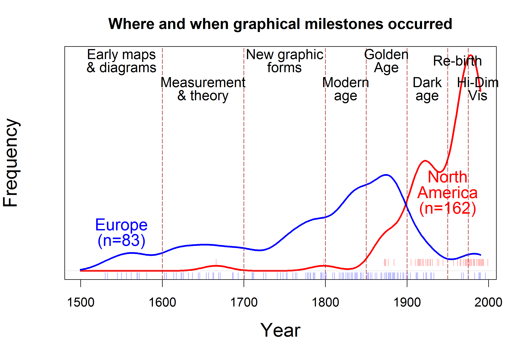

# Introduction {-}

> *The only new thing in the world is the history you don't know.*
> Harry S. Truman, quoted by David McCulloch

## A long history {-}

- The Graphics Social Reporting Project

- The Milestones Project

- Statistical historiography: Visualizing time and history

<!-- ```{r out.width="100%", echo=FALSE, eval=TRUE} -->
<!--  -->
<!-- ``` -->

## Overview {-}

- Re-vsions

- Chronology vs. Theme

## Synopsis of book {-}

**Chapter 1**: *In the Beginning ...* is an overview of the larger questions
and themes that provide a context for the book. We consider the
relations among numerical data, evidence for an argument and graphs, and
then describe some of the pre-history of the visual representation of
numbers and the early rise of visualization itself. The story continues
to the rise of empirical thinking in philosophy and science around the
16th century and the concomitant remarkable development of the visual
representation of numbers to communicate quantitative phenomena.

From there we explore a fundamental and difficult problem in the
17th century: the determination of longitude at sea.
In **Chapter 2**: *The First Graph Got it Right* we show how Michael
Florent van Langren had the idea to make a graph of historical
determinations of the longitude distance from Toledo to Rome, in what is
arguably the first graph of statistical data.

In **Chapter 3**: *The Birth of Data* we trace the role of data in the initial
rise of graphical methods around the early 1800s. We focus attention on
one important participant in this story: Andre-Michel Guerry
[1802--1866], who used an ``avalanche of data'' and graphical
methods to help invent modern social science.

